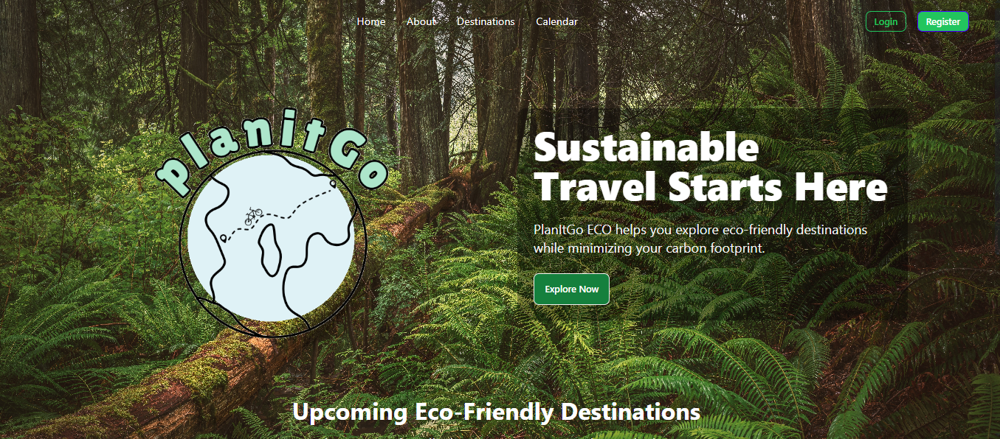
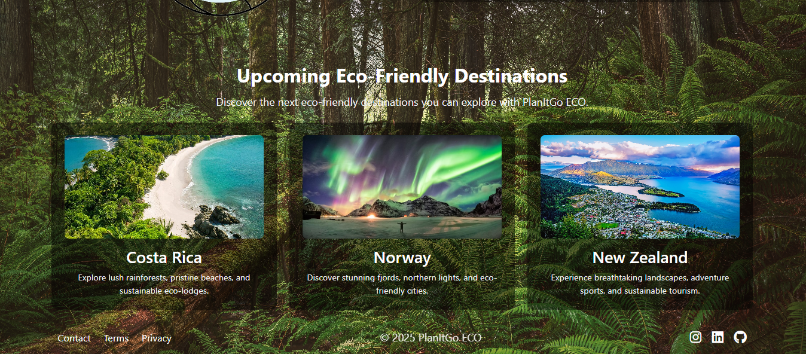
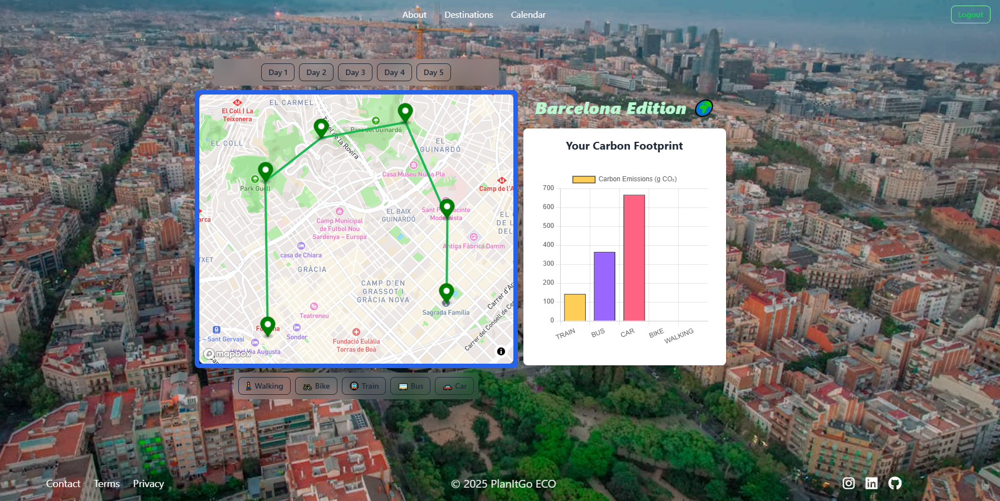
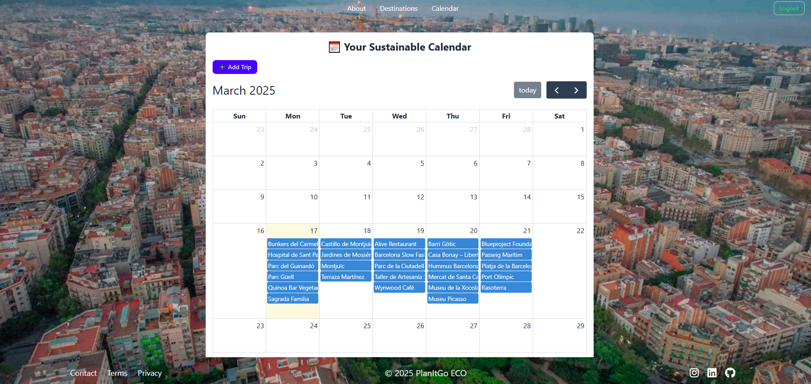

# 🌍 Sustainable Travel App - PlanItGo ECO

## 🚀 Project Overview
This project is an Angular-based web application that integrates multiple plugins and features useful for real-world applications. The goal is to develop a sustainable travel app that includes a **map**, a **calendar**, and **charts** while storing all data in a **MongoDB database** via a **Node.js backend**.
💚 Made with love 🌍✨

##  Features
### ✅ Level 1
- **Navigation Menu**: Includes links to:
  - Home 🏡
  - Map 🗺️
  - Calendar 📅 (FullCalendar integration)
  - Charts 📊 (Chart.js integration)
- **Full CRUD API** in Node.js + MongoDB.
- **User Itineraries**: Users can save and manage their sustainable travel plans.
### 🏡 Home Page



### Login 



### ✅ Level 2
- **Advanced Map Filtering**:
  - Multiple categories of markers (e.g., eco-friendly hotels, restaurants, and attractions).
  - Filter locations dynamically with dropdowns or checkboxes.
- ### 🏡Map Page



### ✅ Level 3
- **Event Editing in Calendar**:
  - Users can **edit** their events via a **modal**.
  - Updated data is **sent to the API** and stored in the database.
- ### Calendar Page



---

## 🛠️ Tech Stack
### Frontend
- **Angular** + **Tailwind CSS**
- **FullCalendar** (for event management)
- **Chart.js** (for visualization)
- **Mapbox** (for interactive maps)

### Backend
- **Node.js** + **Express.js**
- **MongoDB** (Mongoose ODM)
- **REST API** for data persistence

---

## 🏗️ Setup Instructions
### 1️⃣ Clone the Repository
```sh
 https://github.com/Silvitui/inprocode.git
 cd inprocode
```

### 2️⃣ Install Dependencies
#### 📌 Backend
```sh
 cd backend
 npm install
```

#### 📌 Frontend
```sh
 cd frontend
 npm install
```

### 3️⃣ Start the Development Servers
#### 🚀 Start the Backend
```sh
 cd backend
 npm run dev
```
#### 🚀 Start the Frontend
```sh
 cd frontend
 ng serve -o
```

---

# 🌍 Backend Documentation 
## 🚀 Overview
The backend for **PlanItGo ECO** is built using **Node.js** and **Express.js**, with **MongoDB** as the database. It provides a REST API to manage **users**, **itineraries**, and **places** for sustainable travel.

## 🛠️ Tech Stack
- **Node.js** + **Express.js** (Server)
- **MongoDB** (Database)
- **Mongoose** (ODM for MongoDB)
- **JWT Authentication** (For user login and sessions)
- **CORS** (Cross-Origin Resource Sharing)

---
---
## 📂 Project Structure
```
backend/
│── controllers/       # API controllers
│── models/            # Mongoose schemas
│── routes/            # Express routes
│── middlewares/       # Middleware functions
│── config/            # Configuration files
│── server.ts          # Main server file
│── .env               # Environment variables
```

---

## 🌟 Features in Detail
### 🗺️ Map (Mapbox)
- Displays eco-friendly locations.
- Users can **filter markers** based on categories.

### 📅 Calendar (FullCalendar)
- Users can **edit name of the events**.
- Events are **stored in MongoDB**.

### 📊 Charts (Chart.js)
- Displays **carbon footprint statistics**.
- Compares **different transport emissions**.

---


## 🤝 Contribution
Pull requests are welcome! For major changes, please open an issue first to discuss what you would like to change.
---


---

